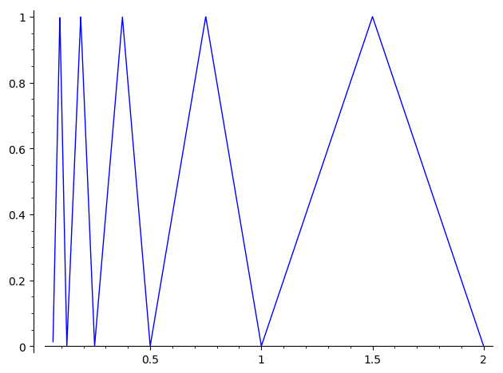

Print your **full name** and **three digit section number** in the top right corner, and return this quiz to me **at the end of class**. Pick the correct answers with the **strongest** justification. Questions from [@Spi94, chapter 13].

1. Is it possible to evaluate the following integral without any computations? 
$$\int_{-1}^1 x^3 \sqrt{1 - x^2}\, dx$$

(A) No, one begins by writing $x^3 \sqrt{1 - x^2} = \sqrt{x^6 - x^8}$.
(B) No, one begins by substituting $x = \sin\theta$ and $dx = \cos\theta\,d\theta$.
(C) Yes, definite integral is just the area $\pi$.
(D) Yes, by symmetry about the line $y = x$, the definite integral is $0$.
(E) Yes, by symmetry about the line $x = 0$, the definite integral is $0$.

2. Is the function $f$ plotted below integrable on $[0,2]$? 

```
f = piecewise([((2,1.5),-2*x+4),((1,1.5),2*x-2), \
               ((0.75,1),-4*x+4), ((0.5,0.75),4*x-2), \
               ((0.375,0.5),-8*x+4), ((0.25,0.375),8*x-2),\
               ((0.1875,0.25),-16*x+4), ((0.125,0.1875),16*x-2),\
               ((0.09375,0.125),-32*x+4), ((0.0625,0.09375),32*x-2)]) # and so on
plot(f, (x, 0,2))
```
{ width=35% }

(A) No, $f$ is discontinuous at infinitely many points.
(B) No, the antiderivative $F$ is discontinuous at infinitely many points.
(C) Yes, the definite integral is just the area $\pi/2$.
(D) Yes, by geometric series, the definite integral is just the area $1$.
(E) Yes, by geometric series, the definite integral is just the area $2$.
