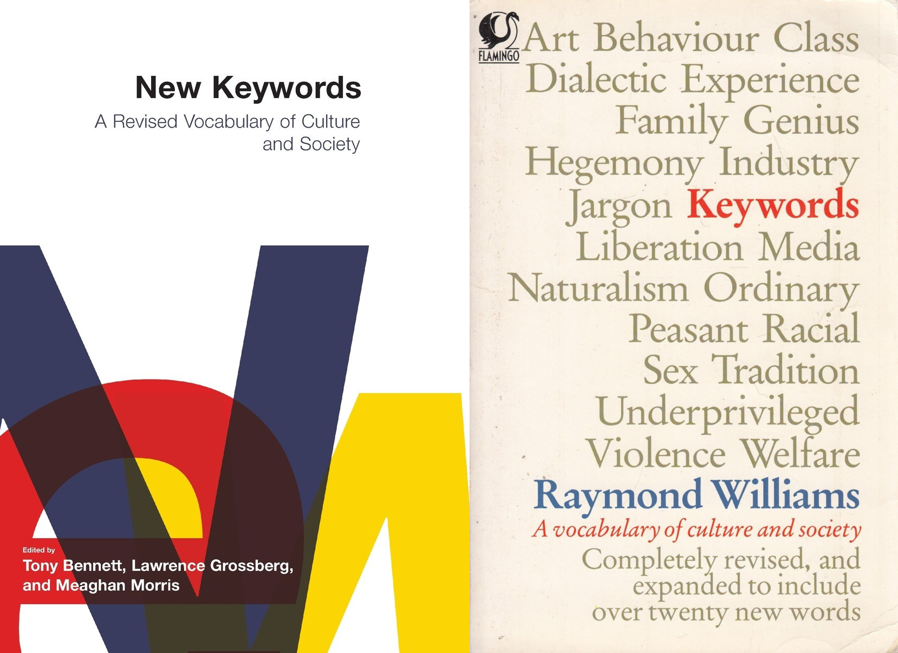

{ width=50% } 

Today's recitation is inspired by two cultural studies, *Keywords* and *New Keywords*, which set out to examine the history of words that are "familiar yet confusing".

## Food for Thought

- How have you developed mental representations to "deal with" the course curriculum?

- Compared to January, what do you think about any of the following "keywords"?

> functions, limits, derivatives, trigonometry, hypotheses testing, implicit differentiation, increase/decrease, maxima/minima, concavity, inflection, tangents, cusps, asymptotes, definite and indefinite integration

- Here's an (optional) exercise from Oliver Knill [@Kni18, section 12] on studying for finals. *As we are heading for our final, let us organize the knowledge accumulated so far. We can do that in various ways. One technique is a **mind map**. It allows on one picture to organize a vast amount of content and see connections which might otherwise be missed. Make a mind map of the most important facts which have appeared in the course so far. Do it on paper, a blackboard, whiteboard or using software. Refine it as much as possible.*

- Here's another exercise to be done with another person. Try writing a practice final exam, schedule a time to take it, then grade it together. 
