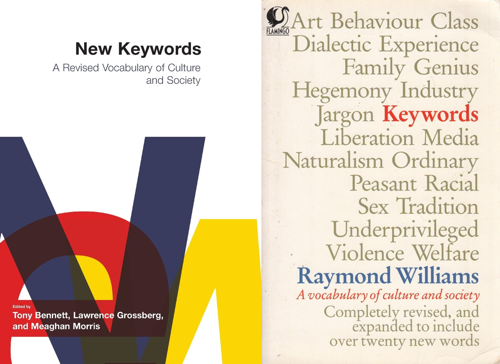

## Keywords

In *16 short academic weeks*, we have developed a sophisticated vocabulary for *Single-Variable Calculus*. We have gone through a fierce struggle to get at the 'correct' interpretation of the following **keywords:**^[See <https://files.vipulnaik.com/math-152/reviewsheetformt1.pdf>, <https://files.vipulnaik.com/math-152/reviewsheetformt2-basic.pdf>.]

> **functions**, **limits**, **derivatives**, **trigonometry**, **hypotheses testing**, **implicit differentiation**, **increase/decrease**, **maxima/minima**, **concavity**, **inflection**, **tangents**, **cusps**, **asymptotes**, **definite and indefinite integration**

Should we take for granted that these concepts, as presented, were organized in a clean, objective fashion?

Consider, for example, the discussion that accompanies sociological keywords: What is a *commodity*? What's *empirical*? What's *fashion?* Who's *family*? When are we being *pragmatic*? *aesthetic*? *natural*? 
    
Today's recitation is motivated by two cultural studies, *Keywords* and *New Keywords*, (Figure 1) which set out to examine the history of words that are "familiar yet confusing".

{ width=75% } 

## Creativity

Verbatim advice from Oliver Knill [@Kni18, section 12]:

> As we are heading for our final, let us organize the knowledge accumulated so far. We can do that in various ways. One technique is a **mind map**. It allows on one picture to organize a vast amount of content and see connections which might otherwise be missed. 

**Exercise (in-class):** Make a mind map of the most important facts which have appeared in the course so far. Do it on paper, a blackboard, whiteboard or using software. Refine it as much as possible. [@Kni18]

**Exercise (at-home):** (a) Write your own final exam! (b) take it! (c) grade it!

## In historical context

Again, from Oliver Knill [@Kni18a]:

> As one has distinguished the canons of **rhetorics**: memory, invention, delivery, style, and arrangement, or combined the **trivium**: grammar, logic and rhetorics, with the **quadrivium**: arithmetic, geometry, music, and astronomy, to obtain the seven liberal arts and sciences, one has tried to organize all mathematical activities.

Historically, one has distinguished *eight ancient roots of mathematics*. Each of these 8 activities in turn suggest a key area in mathematics. **counting and sorting** (arithmetic), **spacing and distancing ** (geometry), **positioning and locating** (topology), **surveying and angulating** (trigonometry), **balancing and weighing** (statics), **moving and hitting** (dynamics), **guessing and judging** (probability), **collecting and ordering** (algorithms).

To morph these 8 roots to the 12 modern mathematical areas, we complement the ancient roots with calculus, numerics and computer science, merge trigonometry with geometry, separate arithmetic into number theory, algebra and arithmetic and turn statics into analysis.

modern root | mathematical area
--- | ---
counting and sorting | arithmetic
spacing and distancing | geometry
positioning and locating | topology
dividing and comparing | number theory
balancing and weighing | analysis
moving and hitting | dynamics
guessing and judging | probability
collecting and ordering | algorithms
slicing and stacking | calculus
operating and memorizing | computer science
optimizing and planning | numerics
manipulating and solving | algebra

## References
