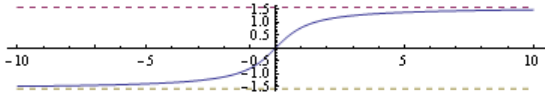
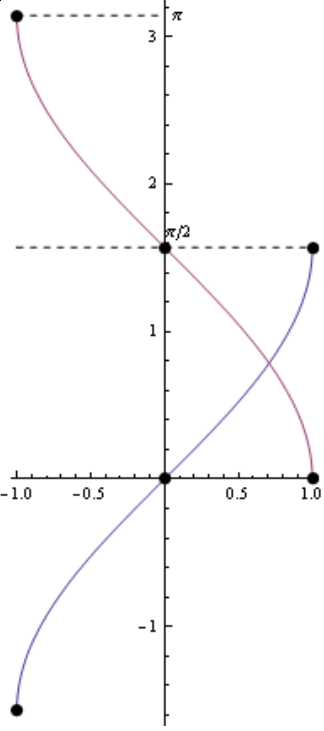

This was an **ungraded** quiz given on 2019-03-07. I didn't collect statistics, but here's my impression (on a $0$ to $4$ scale with $4/4$ high).

problem number | actual class performance | problem difficulty
--- | --- | ---
1 | 2/4 | 2/4
2 | 2/4 | 2/4
3 | 1/4 | 3/4
4 | 2/4 | 4/4

## Definitions

A **function** is a rule $f$ that assigns to each element of a set $A$ to *exactly one* element of a set $B$. We write $$f \colon A \to B$$ to display all the ingredients together. The set $A$ is called the **domain** of $f$, and the set $B$ is called the **codomain** (or **range**) of $f$. We often represent the "data" of a function $f \colon A \to B$ by plotting its **graph**. For example, the graph of the function $\arctan \colon \RR \to (-\frac\pi2, \frac\pi2)$ is the set of *coordinate pairs*$$\{(t, \arctan(t)): \text{ for all } t \text{ in the domain $\RR$}\}.$$
For the following questions, you may find it helpful to look at plots of the graphs of *arctangent*, *arcsine*, and *arccosine* on the back of this sheet.

## Multiple choice

1. $\arcsin$ assigns elements of the set [?] to the set [?]

    (A) $[-1,1] \to[0, \pi]$
    (A) $[-1,1] \to[-\frac\pi2, \frac\pi2]$
    (A) $[-\frac\pi2, \frac\pi2] \to [-1,1]$
    (A) All of the above
    (A) None of the above

   *Correct answer.*^[From Vipul Naik's Math 153 course notes. See <http://files.vipulnaik.com/math-153-sequence/inversetrig.pdf>.] (B) $[-1,1] \to[-\frac\pi2, \frac\pi2]$. Recall that, to construct an inverse function for the $\sin$ function, we need an interval for which the $\sin$ function is increasing from $-1$ to $1$ or decreasing from $-1$ to $1$. There are several choices, but we stick with the interval $[-\pi/2, \pi/2]$, which we call the *principal branch* of the $\sin$ function. The function $\arcsin \colon [-1,1] \to [-\pi/2, \pi/2]$ sends $a$ to the unique $\theta \in [-\pi/2, \pi/2]$ such that $\sin a = \theta$. 

2. $\arccos$ assigns elements of the set [?] to the set [?]

    (A) $[-1,1] \to[0, \pi]$
    (A) $[-1,1] \to[-\frac\pi2, \frac\pi2]$
    (A) $[-\frac\pi2, \frac\pi2] \to [-1,1]$
    (A) All of the above
    (A) None of the above

   *Correct answer.* (A) $[-1,1] \to[0, \pi]$. See plot.

3. One of these functions has a horizontal asymptote as $x \to + \infty$ and a horizontal asymptote as $x \to - \infty$, with the limiting values for $+\infty$ and $- \infty$ being *different*. Identify the function.

    (A) $f(x):= \ln \abs{x}$.
    (B) $f(x):= \arctan{x}$.
    (C) $f(x):= e^{-x}$.
    (D) $f(x):= e^{-x^2}$.

    *Correct answer.* (B) Only $\arctan{x}$ has distinct horizontal asymptotes of the four functions. 

    *Other choices.* One should rule out all of the *even* functions immediately. (A) is false because, for example, $\lim_{x \to +\infty}\ln{x} = \infty$. In other words, the inverse of the natural log, $\exp{x}$, is defined and *finite* for all real numbers. It follows that $\ln\abs{x}$ (because $\ln\abs{-x} = \ln\abs{x}$ is an *even* function) has no horizontal asymptotes. (C) is false because $\exp{-x}$ only has a horizontal asymptote as $x \to +\infty$, but not as $x \to -\infty$. (D) belongs to a family of functions called *Gaussian* functions, most used for *probability distributions*. $\exp{-x^2}$ has two identical horizontal asymptotes $y = 0$.

## True or False

4. Recall that an **open interval** $(a,b)$ is the set of real numbers $\{x : a < x < b\}$. Extending this notion, we say that a subset $O$ of $\RR$ is **open** if

    - for each point $x \in O$, 
    - there's an open interval $(a,b)$ such that
        - the point $x$ is an element of $(a,b)$, and
        - the set $(a,b)$ is contained in $O$. 

    TRUE or FALSE: The domain of $\arctan$ is open. 

    *Correct answer.* TRUE. The set of real numbers $\RR$ is open in itself. In other words, at any point $x$ in $\RR$, there's just enough "breathing room" to fit an open interval $(a,b)$ such that $a < x< b$. 

    *Other answer.* Because $\RR$ has no "boundaries", it is just not possible to find a point $x$ in $\RR$ that doesn't have any "wiggle room".

## Graphs

The **Cartesian plane**, denoted $\RR^2$, is the set of coordinate pairs 
$$\{(x,y) : \text{ for all real numbers } x \text{ and } y\}.$$

So, here are graphs of the inverse trigonometric functions. They are subsets of the Cartesian plane!

{height=8cm}

## References

- Vipul Naik made the plots and wrote question 3. See \url{https://vipulnaik.com/math-152/}.
- I am borrowing *cuisine* as a quiz theme from Hiro Lee Tanaka.
