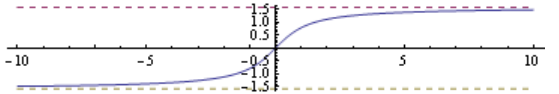
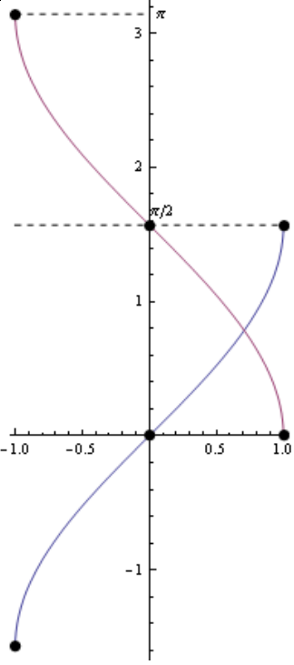

Your name (print clearly in capital letters): \underline{\hspace{8cm}}

This is an **ungraded** quiz that will count for attendance today. It's due at the end of recitation. Dig in!

## Apéritif (definitions)

A **function** is a rule $f$ that assigns to each element of a set $A$ to *exactly one* element of a set $B$. We write $$f \colon A \to B$$ to display all the ingredients together. The set $A$ is called the **domain** of $f$, and the set $B$ is called the **codomain** (or **range**) of $f$. We often represent the "data" of a function $f \colon A \to B$ by plotting its **graph**. For example, the graph of the function $\arctan \colon \RR \to (-\frac\pi2, \frac\pi2)$ is the set of *coordinate pairs*$$\{(t, \arctan(t)): \text{ for all } t \text{ in the domain $\RR$}\}.$$
For the following questions, you may find it helpful to look at plots of the graphs of *arctangent*, *arcsine*, and *arccosine* on the back of this sheet.

## Hors d'oeuvre (multiple choice)

1. $\arcsin$ assigns elements of the set [?] to the set [?]

    (A) $[-1,1] \to[0, \pi]$
    (A) $[-1,1] \to[-\frac\pi2, \frac\pi2]$
    (A) $[-\frac\pi2, \frac\pi2] \to [-1,1]$
    (A) All of the above
    (A) None of the above

   Your answer: \underline{\hspace{8cm}}

2. $\arccos$ assigns elements of the set [?] to the set [?]

    (A) $[-1,1] \to[0, \pi]$
    (A) $[-1,1] \to[-\frac\pi2, \frac\pi2]$
    (A) $[-\frac\pi2, \frac\pi2] \to [-1,1]$
    (A) All of the above
    (A) None of the above

   Your answer: \underline{\hspace{8cm}}

3. One of these functions has a horizontal asymptote as $x \to + \infty$ and a horizontal asymptote as $x \to - \infty$, with the limiting values for $+\infty$ and $- \infty$ being *different*. Identify the function.

    (A) $f(x):= \ln \abs{x}$.
    (B) $f(x):= \arctan{x}$.
    (C) $f(x):= e^{-x}$.
    (D) $f(x):= e^{-x^2}$.

   Your answer: \underline{\hspace{8cm}}

## Digestif (True or False)

4. Recall that an **open interval** $(a,b)$ is the set of real numbers $\{x : a < x < b\}$. Extending this notion, we say that a subset $U$ of $\RR$ is **open** if

    - for each point $x \in O$, 
    - there's an open interval $(a,b)$ such that
        - the point $x$ is an element of $(a,b)$, and
        - the set $(a,b)$ is contained in $O$. 

    TRUE or FALSE: The domain of $\arctan$ is open. 

    Your answer: \underline{\hspace{8cm}}

## Graphs of the promised functions

The **Cartesian plane**, denoted $\RR^2$, is the set of coordinate pairs 
$$\{(x,y) : \text{ for all real numbers } x \text{ and } y\}.$$

So, here are graphs of the inverse trigonometric functions. They are subsets of the Cartesian plane!

{height=8cm}

## References

- Vipul Naik made the plots and wrote question 3. See \url{https://vipulnaik.com/math-152/}.
- I am borrowing *cuisine* as a quiz theme from Hiro Lee Tanaka.
