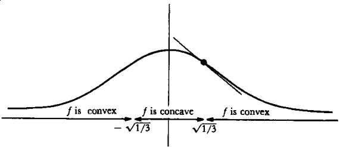

Your name (print clearly in capital letters): \underline{\hspace{8cm}}

This is an **ungraded** quiz that will count for attendance; it is due by the end of recitation.

## Definitions and comments

1. A **zero** (or a **root**) of a function $f$ is $$\text{a point $r$ such that $f(r) = 0$.}$$ 

    i. The term *root* is traditionally^["The **roote quadrat** of the whole number, is the desired distance or line Hypothenusal." (Digges, *Pantom*, 1571).] used for the study of polynomial functions.
    ii. For example, if $r$ is a root of the polynomial function $p$ (that is, if $p(r) = 0$), then $$p(x) = (x - r)q(x) \qq{for some polynomial function $q$.}$$

1. A **critical point** of a function $f$ is $$\text{a point $a$ such that $f'(a) = 0$.}$$

    i. The number $f(a)$ itself is called a **critical value** of $f$.

2. A **point of local extremum** of a function $f$ is $$\text{a point of either local maximum or minimum.}$$

    i. If $b$ is a point of local extremum, we say $f(b)$ is a **local extreme value**.

3. An **inflection point** of a function $f$ is $$\text{a point $c$ such that the tangent line to $f$ at $(c,f(c))$ crosses the graph of $f$.}$$

    i. In order for $c$ to be an inflection point of a function $f$, it is necessary that $f''$ should have different signs to the left and right of $c$.

    ii. For example (see figure), $\sqrt{1/3}$ and $-\sqrt{1/3}$ are inflection points of $f(x) := 1/(1+x^2)$.

{width=12cm}

## Multiple Choice

1.  Consider the function $f \colon \RR \to \RR$ defined by $f(x) = x^3(x - 1)^4(x - 2)^2$. Which of the following **is true**?

    (A) $0$, $1$, and $2$ are all critical points and all of them are points of local extrema.
    (B) $0$, $1$, and $2$ are all critical points, but only $0$ is a point of local extremum.
    (C) $0$, $1$, and $2$ are all critical points, but only $1$ and $2$ are points of local extrema.
    (D) $0$, $1$, and $2$ are all critical points, and none of them is a point of local extremum.
    (E) $1$ and $2$ are the only critical points.

    \vspace{2em}
    Your answer: \underline{\hspace{10cm}}

2.  Say $f\colon \RR \to \RR$ is a differentiable function. What information **can not** be determined from **only** the first derivative $f'$?

    (A) roots of the function
    (B) critical points
    (C) points of inflection
    (D) local extreme values
    (E) neither (D) nor (A)

    \vspace{2em}
    Your answer: \underline{\hspace{10cm}}

3.  Say $f\colon \RR \to \RR$ is a twice-differentiable function. What information **can** be determined from **only** the second derivative $f''$?

    (A) intervals where the function is positive or negative
    (B) intervals where the function increases and decreases
    (C) intervals where the function is concave up and concave down
    (D) $y$-values of horizontal asymptotes
    (E) all of the above

    \vspace{2em}
    Your answer: \underline{\hspace{10cm}}

4.  Suppose $f$ and $g$ are continuously differentiable functions on $\RR$. Suppose $f$ and $g$ are both concave up. Which of the following is **always true**?

    (A) $f + g$ is concave up.
    (B) $f - g$ is concave up.
    (C) $f \cdot g$ is concave up.
    (D) $f \circ g$ is concave up.
    (E) All of the above.

    \vspace{2em}
    Your answer: \underline{\hspace{10cm}}

## References

The definitions are from Spivak [@Spi94]. The questions are adapted from Naik's Math-152 notes [@Nai12].
